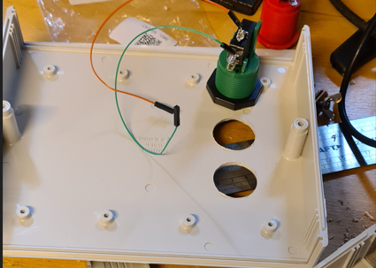

# Raspberry Pi -infotaulu

Raspberry Pi -infotaulu on käytännön tarpeeseen tehty apuvälineprojekti. Projektin tavoitteena oli tehdä selkeä infonäyttö henkilölle, jolla on muistisairautta ja heikentynyt näkö. Näytöllä näytetään arjen kannalta tärkeitä tietoja suurella tekstillä, ja näkymää voidaan vaihtaa fyysisillä painikkeilla ilman näppäimistöä tai hiirtä.

[Video laitteen toiminnasta]

## Toiminta

Infotaulussa on kolme yksinkertaista näkymää. Painikkeilla voi näyttää kellonajan, päivämäärän tai tiedon siitä, milloin seuraava toimintapäivä on. Jokaiselle näkymälle on oma painike, jolloin laitteen käyttö pysyy mahdollisimman suoraviivaisena.

Ohjelma käynnistyy automaattisesti, kun Raspberry Pi saa virran. Näin laite voidaan ottaa käyttöön pelkästään kytkemällä virta päälle.

## Toteutus

Projektissa Raspberry Pi ohjaa näyttöä ja lukee painikkeiden tilaa GPIO-tulojen kautta. Käyttöliittymä toteutettiin Pythonilla, ja siinä painotettiin suurta tekstikokoa sekä selkeää näkymärakennetta.

Ohjelmiston lisäksi projektiin kuului myös jonkin verran käytännön rakentamista. Painikkeet kiinnitettiin erilliseen koteloon, niihin juotettiin kytkentäjohdot ja painikkeet kytkettiin Raspberry Pi:n GPIO-tuloihin. Näin infotaululle saatiin yksinkertainen fyysinen ohjauspaneeli.

  

  <em>Painikekotelon rakentamista.</em>

Nykyisten painikkeiden toimintoja voisi tarvittaessa muuttaa, ja koteloon olisi mahdollista lisätä myös uusia painikkeita. Tässä projektissa kolme painiketta riitti kuitenkin tarvittaviin näkymiin.
